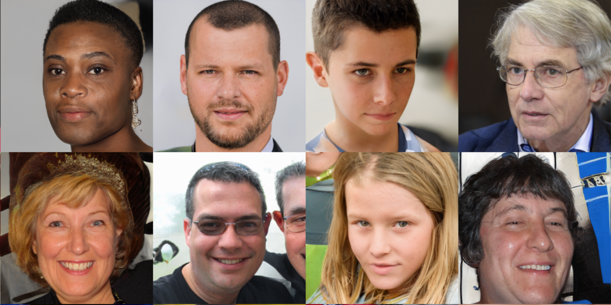

# GGDR + Face parser
Alethio Inc.
## Credit
We attach real image regularization using face parser's feature maps to GGDR. This code is heavily based on
 - [GGDR](https://github.com/naver-ai/GGDR)
 - [StyleGAN2-ADA-pytorch](https://github.com/NVlabs/stylegan2-ada-pytorch)
 - [face-parsing.PyTorch](https://github.com/zllrunning/face-parsing.PyTorch)

## Usage
Usage of this repository is almost same with [StyleGAN2-ADA-pytorch](https://github.com/NVlabs/stylegan2-ada-pytorch) except GGDR & face parser option. See their repository for more detailed instructions.

- Download checkpoints of [face-parsing.PyTorch](https://github.com/zllrunning/face-parsing.PyTorch)

#### Training StyleGAN2-ADA with GGDR
```
> python train.py --outdir=training-runs  --parser=/path/to/parser/ckpt/model.pth --reg_type=ggdr --ggdr_res=64 --gpus=8 --cfg=paper256 --data=./datasets/ffhq256.zip
```
Belows are some additional arguments can be customized.
- ```--parser=/path/to/parser/ckpt/model.pth``` Specify checkpoints of the face parser. (default: disabled) 
- ```--reg_type=ggdr``` Enable GGDR (default: disabled)
- ```--ggdr_res=64``` Set target feature map by given resolution for GGDR (default: 64). If you use smaller images(e.g. cifar10), it is recommended to set this $(resolution) / 4 (e.g. 8 for cifar10).
- ```--aug=noaug``` Disables ADA (default: enabled)
- ```--mirror=1``` Enables x-flips (default: disabled)

#### Inference with trained model
- Download checkpoints [here](https://kr.object.ncloudstorage.com/backup-bucket/public/ggdrface-network-snapshot.pkl)
```
> python generate.py --outdir=out --seeds=100-200 --network=PATH_TO_MODEL
```

## Results
- FID 3.10669 for FFHQ 256

### Selective samples
<div align="left">
  
</div>


## License
- Licensed under NVIDIA Source Code License for StyleGAN2 with Adaptive Discriminator Augmentation (ADA).
- Licensed under MIT License face-parsing.PyTorch
